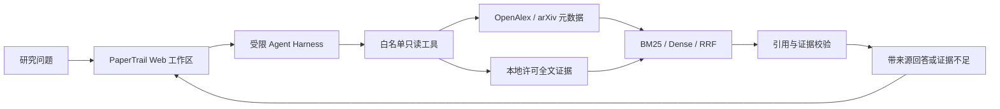

# PaperTrail · 论文检索与研究助理 Agent

**从研究问题出发，检索真实论文；让 Agent 使用受控工具逐步查证，并把回答中的证据和来源展示出来。**

PaperTrail 是一个用于学习和简历展示的全栈 Agent 项目。它接入 OpenAlex 与 arXiv 元数据，支持人工许可登记后的全文证据检索，并提供中文研究工作区。项目重点是 Agent Harness、可追溯 RAG 和可重复评测，不是生产级文献服务。

> 当前实现：元数据搜索、受限工具 Agent、许可全文 RAG、BM25/Dense/Hybrid 检索与本地 Web 工作区。Agent 默认关闭；OpenAI 调用需服务端显式配置。评测数字和限制见下文。

## 演示流程



## 主要功能

- **真实论文发现**：通过固定 OpenAlex Works 与 arXiv API 搜索、查看和导入论文元数据；保存查询快照、来源、许可标识及内容哈希，方便复现。
- **可控的 Agent Harness**：模型通过 Responses API 请求固定工具；服务端校验参数、工具调用预算、决策步数和 deadline。Harness 检查引用是否来自本轮工具结果，证据不足时可以拒答。
- **许可门控的全文 RAG**：全文只从本地 UTF-8 文本导入，并要求逐篇审核许可和署名；支持精确字符定位、BM25 与可撤销删除。元数据开放不代表全文自动获准。
- **检索对照**：提供 BM25、Dense cosine 和 RRF Hybrid。BM25 可离线复现；Dense/Hybrid 可明确启用 OpenAI Embeddings，并记录模型、token 与估算费用。
- **中文研究工作区**：按 OpenAlex、arXiv 或本地库检索；查看论文详情、并列比较元数据、向研究助理提问并展开引用、证据片段和运行 trace。
- **安全和可观测性**：工具为只读白名单；不提供任意 URL 抓取、shell 或 SQL 工具。Trace 记录工具名、状态、耗时和 token，不记录问题、论文正文或密钥。

## 技术结构

| 部分 | 实现 |
|---|---|
| Web | Next.js 16、React 19、TypeScript；同源 API 代理将服务端密钥留在后端 |
| API 与 Agent | FastAPI、Pydantic、OpenAI Responses function calling、受限 Harness |
| 数据与来源 | SQLite 迁移、不可变元数据版本、OpenAlex 快照与哈希；OpenAlex / arXiv 客户端固定官方主机 |
| 检索 | 自实现 Okapi BM25、OpenAI Embeddings cosine、RRF@60 |
| 测试 | pytest、Ruff、Playwright；mock/合成数据标记 `TEST-*` 与 `synthetic=true` |

## 评测结果与适用范围

### P14：固定语料上的检索方法对照

同一份 100 篇 OpenAlex 元数据、30 个查询和同一组 P13 候选标签上，比较 BM25、Dense 与 Hybrid。Hit@1、MRR@10、NDCG@10 如下：

| 方法 | Hit@1 | MRR@10 | NDCG@10 |
|---|---:|---:|---:|
| BM25 | 0.5333 | 0.6444 | 0.5222 |
| Dense (`text-embedding-3-small`) | 0.8333 | 0.8562 | 0.6464 |
| Hybrid (RRF@60) | 0.7000 | 0.8208 | 0.6321 |

**重要限制：** P13 的 3,000 个分数是从候选建议复制的 AI 标签，未经人工核验；语料也来自单一主题搜索。因此 P14 是工程诊断，不是金标准评测，不能用来证明 Dense 优于 BM25，也不能外推到真实用户检索。Dense 本次处理 130 个输入、23,960 tokens，单次估算费用约 USD 0.0004792；向量未持久化。完整配置、分桶和低分查询见 [P14 验收记录](docs/research/P14-acceptance.md) 与本机报告 `backend/reports/p14-retrieval-comparison.json`（报告目录被 Git 忽略，不包含在仓库中）。

### Agent / RAG 测试

- 后端自动测试：**99 passed**；包含工具循环、来源客户端、许可全文检索、向量检索、Agent 引用约束及 P14 评测器。
- P12 离线 Agent 场景：3/3 mock 场景通过；越权工具尝试被拦截，未授权工具执行为 0。它验证安全与评测管线，不代表真实 LLM 回答质量。
- Web E2E：覆盖论文搜索、详情、比较、Agent 证据展示、错误重试和键盘操作；结果与 Windows 进程退出限制见 [P11 记录](docs/research/P11-acceptance.md) 和 [P12 记录](docs/research/P12-acceptance.md)。
- 一篇经许可确认的 arXiv 全文完成本机导入、证据定位、Agent 引用与删除/恢复 smoke；单篇 smoke 不代表全文 RAG 的统计质量。

## 本地启动

需要 Python 3.12、uv、Node.js 24 和 pnpm 11。详细说明见[开发与验收指南](docs/development.md)。

```powershell
# 终端一：后端
cd backend
uv sync --locked --all-groups
uv run --locked uvicorn app.main:app --host 127.0.0.1 --port 8001 --reload

# 终端二：Web
cd web
pnpm install --frozen-lockfile
pnpm dev
```

打开 `http://127.0.0.1:3000`。OpenAI LLM 与 Embedding provider 默认禁用；密钥只放在仓库根目录 `.env`，不要放入前端环境变量或提交到 Git。OpenAlex 和 arXiv 搜索需要后端网络访问。若只运行 BM25/自动测试，无需启用收费模型。

## 评测与测试命令

```powershell
cd backend
uv run --locked ruff check .
uv run --locked ruff format --check .
uv run --locked pytest -q
uv run --locked python -m app.cli.evaluate_p12
```

P14 需要显式允许调用 OpenAI Embeddings，可能产生少量费用：

```powershell
uv run --locked python -m app.cli.evaluate_p14 --allow-provider-call
```

Web 检查：

```powershell
cd web
pnpm run format:check
pnpm run typecheck
pnpm run build
# Windows 本机 E2E：先在此终端之外按开发手册启动 3001 端口服务
pnpm run test:e2e
```

E2E 使用浏览器 API mock；Windows 本机需先启动 3001 服务，详情见[开发说明](docs/development.md#p11-web-研究工作区)。

## 项目边界

- 这是学习研究与简历展示项目，不提供生产 SLA、线上可用率或大规模服务承诺。
- P13/P14 相关性标签没有人工全审；检索指标只能作为探索性结果。
- 真实论文全文不随仓库分发；使用全文前需逐篇确认许可证、证据链接及署名要求。
- LLM 生成质量、真实 Agent 任务成功率和多用户压力表现尚未系统评估。
- PaperTrail 现位于仓库根目录；旧电脑推荐项目源码已从当前工作树移除。
- 本仓库尚未选择源码复用许可证；公开展示不等于授予再发布或商用许可。

## 项目记录

- [阶段进度](docs/PROGRESS.md) · [任务台账](docs/TASKS.md) · [项目规格](docs/PROJECT_SPEC.md) · [执行计划](docs/EXECUTION_PLAN.md)
- [P12 端到端评测](docs/research/P12-acceptance.md) · [P13 数据集与 AI 标签](docs/research/P13-acceptance.md) · [P14 检索对照](docs/research/P14-acceptance.md)
- [API 契约](docs/openapi.json) · [开发说明](docs/development.md)
