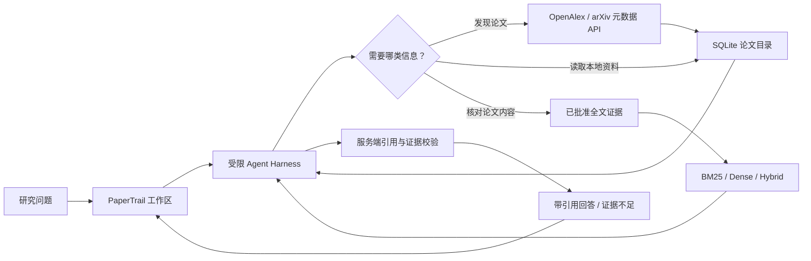

# PaperTrail · 论文检索与研究助理 Agent

**从研究问题出发发现论文，让 Agent 逐步检查知识库，并用可追溯的证据回答。**

[](https://github.com/ZXN1225/papertrail/actions/workflows/ci.yml)


PaperTrail 是一个用于学习研究与简历展示的全栈 Agent 项目。它连接 OpenAlex 和 arXiv 元数据，提供论文检索、比较、许可全文 RAG 与研究助理工作区。项目聚焦 Agent Harness、证据溯源和可重复评测；它不是生产级文献服务，也不代替系统综述或研究者判断。

## 项目能做什么

- **发现与管理论文**：从 OpenAlex、arXiv 搜索元数据，或使用已导入的本地目录；保存查询快照、来源、版本和内容哈希，支持重复导入与历史快照查看。
- **逐步研究**：Agent 可搜索目录、查看单篇论文、查找词法相似论文、比较元数据，并根据问题决定是否继续调用工具。
- **许可全文问答**：逐篇登记并确认 CC0 或 CC BY 许可后，才可将本地 UTF-8 文本导入；全文按可追踪位置分块，支持 BM25、Dense 和 Hybrid 检索。
- **可核验回答**：引用绑定本轮工具返回的论文 ID、证据片段、来源和位置；引用无效或证据不足时，Harness 会拒绝完成为可信答案。
- **检索实验**：在相同语料和查询上比较 BM25、Dense cosine 与 RRF Hybrid，输出指标、配置、数据哈希和成本估算。
- **中文研究工作区**：浏览论文、查看详情、并列比较元数据、向研究助理提问，并查看引用、证据片段和运行 trace。

## 工作流



Agent 使用服务端固定工具，不允许模型执行任意 SQL、shell 或 URL 抓取。论文标题、摘要、全文片段和工具输出都按不可信数据处理。

## Agent 与 RAG 设计

### 固定工具集

| 工具类型 | 能力                                                    | 边界                                                              |
| -------- | ------------------------------------------------------- | ----------------------------------------------------------------- |
| 本地目录 | 搜索论文、读取详情、查找词法相似论文、比较 2–5 篇论文   | 只读已导入的元数据；“相似”不是引用关系                            |
| OpenAlex | 搜索 Works、读取 Work、搜索/读取 Author、列出作者 Works | 固定官方 API 主机；请求字段、页大小、超时均受限                   |
| arXiv    | 搜索和读取论文元数据                                    | 固定官方 API；限速；不会通过该工具下载 PDF                        |
| 许可全文 | 检索批准全文的片段并返回定位与署名信息                  | 仅使用当前批准版本；BM25 默认，Dense/Hybrid 需显式启用 Embeddings |

### Agent Harness 的运行约束

- 工具参数经 Pydantic schema 验证，未知工具和多余参数会被拒绝。
- 每次运行限制决策步数、工具调用次数、总时限和观察内容大小。
- Harness 校验模型给出的引用是否来自本轮工具观察，并验证证据片段和论文 ID 的对应关系。
- 元数据只能支持元数据层面的说法；论文结论必须有全文证据。证据不足时明确拒答，不从模型记忆补写论文事实。
- Trace 记录步骤、工具状态、耗时和 token 计数，不记录密钥或论文正文。

### 检索管线

1. 解析查询并检查本地知识库中的论文对象。
2. 按需搜索标题/摘要元数据，Agent 可根据结果决定继续查看哪些论文。
3. 只有问题需要论文内容且本地存在获准全文时，才检索全文证据。
4. 返回片段、来源、许可、署名和字符位置，再由 Harness 检查引用。

BM25 为默认全文检索，不调用外部 Embeddings 服务。Dense 使用 OpenAI Embeddings 与 cosine 相似度；Hybrid 用 BM25 与 Dense 排名进行 RRF（`k=60`）。Embedding provider 默认关闭；启用后，获准全文片段和搜索问题会发送到配置的 Embeddings API。

## 技术栈

| 层     | 技术                                                                      |
| ------ | ------------------------------------------------------------------------- |
| Web    | Next.js 16、React 19、TypeScript                                          |
| API    | FastAPI、Pydantic、Uvicorn                                                |
| Agent  | OpenAI Responses API function calling、受限 Agent Harness、服务端引用校验 |
| 数据   | SQLite、SQL 迁移、不可变元数据版本、来源快照与 SHA-256                    |
| 数据源 | OpenAlex Works / Authors API、arXiv API                                   |
| 检索   | 自实现 Okapi BM25、可选 OpenAI Embeddings cosine、RRF@60                  |
| 测试   | pytest、Ruff、Prettier、TypeScript、Playwright、GitHub Actions            |

## 评测结果与可信边界

### P05：小规模人工复核 BM25 集

80 条论文-查询相关性判断由用户人工复核，数据集包含 8 个查询和 10 篇论文。重跑 BM25 的结果为：

| 指标    |   结果 |
| ------- | -----: |
| Hit@1   |   0.75 |
| MRR@10  |  0.875 |
| NDCG@10 | 0.8849 |

这是小样本流程验收与探索性结果，不能推断大规模检索质量。

### P14：BM25、Dense、Hybrid 对照

在 100 篇 OpenAlex 元数据和 30 个查询上对比相同候选集：

| 方法                             |  Hit@1 | MRR@10 | NDCG@10 |
| -------------------------------- | -----: | -----: | ------: |
| BM25                             | 0.5333 | 0.6444 |  0.5222 |
| Dense (`text-embedding-3-small`) | 0.8333 | 0.8562 |  0.6464 |
| Hybrid (RRF@60)                  | 0.7000 | 0.8208 |  0.6321 |

**解读限制：** P14 使用的 3,000 个相关性分数来自 AI 候选建议，未经人工核验；语料也来自单一主题搜索。因此这些结果只用于工程诊断，不能证明 Dense 优于 BM25，也不能代表真实用户检索表现。该次 Dense 运行处理 23,960 个输入 tokens，估算费用约 USD 0.0004792；实际账单以账户记录为准。完整分桶、配置与限制见 [P14 记录](docs/research/P14-acceptance.md)。

### Agent / Web 验证

- 后端自动测试：**99 passed**，覆盖 Agent 工具循环、来源客户端、全文许可门禁、精确证据定位、检索与引用校验。
- 离线 Agent 安全评测：**3/3 mock 场景通过**；越权工具尝试被拦截，未授权工具执行为 0。它验证安全和评测管线，不代表真实模型质量。
- Web Playwright：**15/15 E2E 通过**，包含搜索、详情、比较、Agent 证据展示、错误重试和键盘操作。
- GitHub Actions：后端与 Web jobs 均通过，包含 Ruff、pytest、OpenAPI 契约、前端类型检查、生产构建及浏览器 E2E。

一篇经许可确认的 arXiv 全文完成了本机导入、检索、Agent 引用和删除/恢复 smoke。这只验证单篇闭环，不代表全文检索的统计质量。更多阶段记录见 [`docs/research/`](docs/research/)。

## 本地运行

### 环境要求

- Python 3.12 与 [uv](https://docs.astral.sh/uv/)
- Node.js 24 与 pnpm 11
- SQLite 随应用运行，无需单独安装数据库服务

### 配置服务端环境

在仓库根目录复制配置模板；若 `.env` 已存在，不要覆盖：

```powershell
if (-not (Test-Path .env)) { Copy-Item .env.example .env }
```

编辑 `.env`。`OPENALEX_API_KEY` 可选；`LLM_PROVIDER` 和 `EMBEDDING_PROVIDER` 默认均为 `disabled`。只有显式配置服务端模型凭据后，Agent 或 Dense/Hybrid Embeddings 才会调用 OpenAI。不要把密钥写入 Web 环境变量或提交到 Git。

### 启动 API 与 Web

终端一启动后端：

```powershell
cd backend
uv sync --locked --all-groups
uv run --locked uvicorn app.main:app --host 127.0.0.1 --port 8001 --reload
```

终端二启动 Web：

```powershell
cd web
pnpm install --frozen-lockfile
pnpm dev
```

打开 <http://127.0.0.1:3000>。API 文档位于 <http://127.0.0.1:8001/docs>；存活与就绪检查分别是 `/api/health/live` 和 `/api/health/ready`。首次 Web 安装后如果没有 Playwright 浏览器，执行 `pnpm exec playwright install chromium`。

### 导入论文数据

导入少量 OpenAlex 元数据到本地 SQLite：

```powershell
cd backend
uv run --locked python -m app.cli.import_openalex --query "retrieval augmented generation" --per-page 10
```

导入一页 arXiv 元数据：

```powershell
uv run --locked python -m app.cli.import_arxiv --query 'all:"retrieval augmented generation"' --max-results 10
```

元数据搜索会访问对应公开 API；导入命令只保存元数据，不下载全文。更多来源与本机验收步骤见[开发与验收指南](docs/development.md)。

### 许可全文 RAG

全文导入前，需从原始来源核对具体论文的许可、来源链接和署名要求。当前仅允许明确确认的 `CC0-1.0` 与 `CC-BY-4.0`；“可免费阅读”、`is_oa=true` 或元数据许可均不能代替全文许可。项目不会自动抓取全文，全文和 PDF 不随仓库分发。

准备好本地 UTF-8 `.txt` 和 manifest 后，按[全文导入说明](docs/development.md#许可全文导入与检索-p09)运行导入命令。之后可调用：

```text
GET /api/v1/evidence/search?q=knowledge%20base&limit=5&retrieval_method=bm25
```

没有批准全文时，接口返回 `no_results`，不会把摘要伪装成全文证据。

## Agent API 示例

启用 OpenAI Responses provider 后，调用 `POST /api/v1/agent/ask`：

```json
{
  "question": "请找出 RAG 检索质量评测的代表论文，并说明本地元数据能支持什么结论？"
}
```

响应包含 `status`、答案、引用、警告、工具调用数、模型步骤、token 计数、`run_id` 和 trace。若没有启用 LLM，接口会返回 `model_disabled`；它不会生成伪造的回答。API 的完整 schema 见 [`docs/openapi.json`](docs/openapi.json)。

## 评测与测试命令

后端：

```powershell
cd backend
uv run --locked ruff check .
uv run --locked ruff format --check .
uv run --locked pytest -q
uv run --locked python -m tools.export_openapi
uv run --locked python -m app.cli.evaluate_p12
```

Web：

```powershell
cd web
pnpm run format:check
pnpm run typecheck
pnpm run build
pnpm run test:e2e
```

P14 会访问 OpenAI Embeddings，可能产生少量费用；只有显式确认后才运行：

```powershell
cd backend
uv run --locked python -m app.cli.evaluate_p14 --allow-provider-call
```

Windows 本机 E2E 若在所有断言结束后未正常退出，可先在独立终端启动 `node ./node_modules/next/dist/bin/next dev --hostname 127.0.0.1 --port 3001`，再运行 Playwright。GitHub Actions 在 Linux 上会自动管理该服务。

## 项目结构

```text
.
├── backend/
│   ├── app/agent/       # Harness、Responses 模型客户端、固定工具集
│   ├── app/embeddings/  # 可选 Embeddings Provider
│   ├── app/evaluation/  # BM25、P12/P14 与评测指标
│   ├── app/retrieval/   # BM25、全文切块、向量与融合检索
│   ├── app/sources/     # OpenAlex 和 arXiv 客户端
│   ├── app/storage/     # SQLite repository 与版本化迁移
│   ├── app/cli/         # 导入、评测、向量索引与全文撤销 CLI
│   ├── data/evaluation/ # 可复现评测集
│   └── tests/           # API、存储、Agent、RAG 与评测测试
├── web/
│   ├── app/             # 研究工作区与同源 API 代理
│   ├── components/      # 搜索、论文详情、比较和 Agent UI
│   └── tests/e2e/       # 浏览器端端到端用例
├── docs/
│   ├── research/        # 各阶段验收与研究记录
│   ├── development.md   # 本机运行、数据导入与验收说明
│   └── openapi.json     # API 契约
└── .github/workflows/  # 后端与 Web 持续集成
```

## 已知限制

- 这是学习与简历项目，不提供生产 SLA、线上可用率或大规模服务承诺。
- P05 人工复核集仅 8 个查询、10 篇论文，仍是探索性小样本。
- P13/P14 相关性标签未经人工全审，相关检索指标不能作为质量声明。
- 尚未系统评估真实用户任务成功率、LLM 回答质量和多用户压力表现。
- 全文许可逐篇人工核对；项目源码目前未选择再发布许可证。公开仓库不自动授予代码复用许可。

## 项目文档

- [项目规格](docs/PROJECT_SPEC.md) · [任务台账](docs/TASKS.md) · [阶段进度](docs/PROGRESS.md) · [执行计划](docs/EXECUTION_PLAN.md)
- [开发与验收指南](docs/development.md) · [OpenAPI 契约](docs/openapi.json)
- [P05 人工复核评测](docs/research/P05-acceptance.md) · [P12 Agent 离线评测](docs/research/P12-acceptance.md) · [P14 检索对照](docs/research/P14-acceptance.md)
