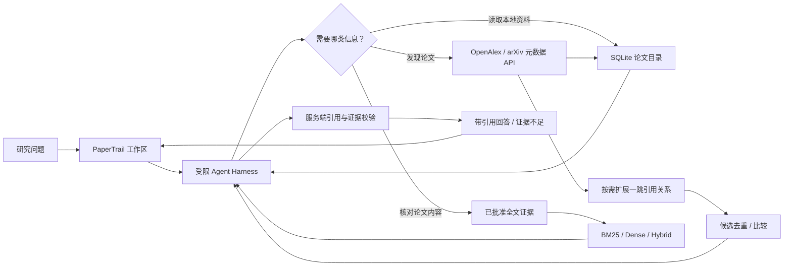

# PaperTrail · 论文检索与研究助理 Agent

**从研究问题出发发现论文，让 Agent 逐步检查知识库，并用可追溯的证据回答。**

[](https://github.com/ZXN1225/papertrail/actions/workflows/ci.yml)


PaperTrail 是一个用于学习研究与简历展示的全栈 Agent 项目。它连接 OpenAlex 和 arXiv 元数据，提供论文检索、比较、许可全文 RAG 与研究助理工作区。项目聚焦 Agent Harness、证据溯源和可重复评测；它不是生产级文献服务，也不代替系统综述或研究者判断。

## 项目能做什么

- **发现与管理论文**：从 OpenAlex、arXiv 搜索元数据，或使用已导入的本地目录；保存查询快照、来源、版本和内容哈希，支持重复导入与历史快照查看。
- **扩展文献集合**：Agent 可从研究问题检索种子论文，再按需沿 OpenAlex 的参考文献或被引关系拓展一跳，去重并比较候选。引用关系是发现线索，不代表论文结论一致或互相支持。
- **许可全文问答**：逐篇登记并确认 CC0 或 CC BY 许可后，才可将本地 UTF-8 文本导入；全文按可追踪位置分块，支持 BM25、Dense 和 Hybrid 检索。
- **可核验回答**：论文引用必须来自本轮工具结果；获准全文证据额外保留片段、来源、许可和位置。引用无效或证据不足时，Harness 会拒绝完成为可信答案。
- **运行时 Agent Skills**：内置文献发现、全文证据综合和引用脉络三种任务工作流；激活后，模型只能使用该 Skill 的固定工具子集。
- **连续研究上下文**：Agent 请求会携带最近 4 轮对话，以及左侧最近一次检索的来源、关键词、年份范围和已载入页数。后端会从固定来源重新读取最多 30 篇书目元数据供后续问题引用；浏览器传来的论文正文不会直接作为可信证据。历史回答只帮助理解“刚才的结果”等指代，不会成为事实证据。
- **检索实验**：在相同语料和查询上比较 BM25、Dense cosine 与 RRF Hybrid，输出指标、配置、数据哈希和成本估算。
- **中文研究工作区**：浏览论文、查看详情、并列比较元数据、向研究助理提问，并查看引用、证据片段和运行 trace。

## 工作流



Agent 使用服务端固定工具，不允许模型执行任意 SQL、shell 或 URL 抓取。论文标题、摘要、全文片段和工具输出都按不可信数据处理。

## Agent 与 RAG 设计

### 固定工具集

| 工具类型 | 能力                                                                       | 边界                                                                                                                                                                              |
| -------- | -------------------------------------------------------------------------- | --------------------------------------------------------------------------------------------------------------------------------------------------------------------------------- |
| 本地目录 | 搜索论文、读取详情、查找词法相似论文、比较 2–5 篇论文                      | 只读已导入的元数据；“相似”不是引用关系                                                                                                                                            |
| OpenAlex | 搜索/读取 Works、Authors、作者 Works；按需扩展种子论文的参考文献或被引作品 | 固定官方 API 主机；年份/OA 条件为结构化白名单；最多一跳、每方向最多 10 条；关系只作发现线索。调用依据：[OpenAlex 引用 API recipes](https://help.openalex.org/how-to/api-recipes/) |
| arXiv    | 搜索和读取论文元数据；支持提交年份范围                                     | 固定官方 API；限速；年份按提交日期筛选；不会通过该工具下载 PDF                                                                                                                    |
| 许可全文 | 检索批准全文的片段并返回定位与署名信息                                     | 仅使用当前批准版本；BM25 默认，Dense/Hybrid 需显式启用 Embeddings                                                                                                                 |

### Agent Harness 的运行约束

- 工具参数经 Pydantic schema 验证，未知工具和多余参数会被拒绝。
- 每次运行限制决策步数、工具调用次数、总时限和观察内容大小。
- Harness 校验模型给出的引用是否来自本轮工具观察，并验证证据片段和论文 ID 的对应关系。
- 元数据只能支持元数据层面的说法；论文结论必须有全文证据。证据不足时明确拒答，不从模型记忆补写论文事实。
- Trace 记录步骤、工具状态、耗时和 token 计数，不记录密钥或论文正文。
- 工作流建议：先依据主题和约束检索；结果过窄或需要追溯研究脉络时，再选种子作品扩展一跳并去重；比较候选时只陈述元数据能支持的内容；涉及研究发现时再调用批准全文证据。上游失败、无结果或证据不足会保留为明确状态。

### Runtime Skills

| Skill                  | 适用任务                         | 允许的工具范围                             |
| ---------------------- | -------------------------------- | ------------------------------------------ |
| `literature_discovery` | 发现和筛选论文书目               | 已启用的本地、OpenAlex 和 arXiv 元数据工具 |
| `evidence_synthesis`   | 总结、比较论文方法或发现         | 获准全文证据检索，以及可用的精确元数据读取 |
| `citation_analysis`    | 沿 OpenAlex 引用关系扩展研究脉络 | Works 搜索/读取与有界一跳引用扩展          |

Skill 定义保存在 `backend/app/agent/skills.json`，只包含说明文字和工具名称；Harness 校验目录后，将 Skill 工具范围收窄到当前已启用的固定白名单。一次运行只能激活一个 Skill，工具次数与运行时限仍由 Harness 统一限制。Skill 不加载脚本，不授予任意 URL、文件、shell、SQL 或写库能力。根目录 [`skills/`](skills/README.md) 是供贡献者和 Codex 使用的开发工作流文档；PaperTrail Agent 不会读取该目录。两类 Skills 使用不同目录和加载路径。

### 检索策略选型及原因

策略按研究任务分层组合，而不是把某个排序模型用于所有场景。决策优先考虑证据类型、数据许可、可复现性和运行成本；质量数字见下方同集对照。

| 研究需求               | 选用策略                                     | 选型原因                                                                    | 实测依据与边界                                                                                          |
| ---------------------- | -------------------------------------------- | --------------------------------------------------------------------------- | ------------------------------------------------------------------------------------------------------- |
| 发现论文、浏览书目     | OpenAlex / arXiv 元数据检索；本地目录用 BM25 | 公开来源提供结构化书目字段；本地 BM25 无 Embedding 费用，结果容易复现和解释 | P05 小样本人工复核集用于验证基线流程；OpenAlex 与 arXiv 的年份定义不同，页面会分别标明出版年和提交日期  |
| 根据获准全文查找证据   | 全文 BM25 默认；Dense 或 RRF Hybrid 显式启用 | 全文需逐篇通过许可登记；BM25 保持本地可用，语义检索作为可选对照             | P14/P17 在冻结元数据集上做过排序诊断，但并非全文 RAG 质量评测；当前真实许可全文规模也不足以支持统计结论 |
| 从种子论文拓展研究脉络 | OpenAlex 一跳参考文献 / 被引关系             | 引用邻居能补充关键词检索未命中的候选，且保留来源和关系便于复核              | 仅作发现线索；不是论文结论的证据，也不假设新候选比原搜索结果更相关                                      |
| 合并多个公开来源结果   | OpenAlex + arXiv，按完全匹配 DOI 去重        | 兼顾综合书目与预印本发现；严格 DOI 匹配避免仅凭标题误合并                   | 跨源用例已纳入离线 Agent 工作流评测；没有把离线通过率解释为线上召回率                                   |

当前默认仍是元数据检索与全文 BM25。Dense/Hybrid 要显式配置 Embeddings provider，选择 Large 是可选实验路径，不会因模型通用基准较高就自动替换默认排序。Small 与 Large 的运行对照及成本列于下方；OpenAI 的 MTEB 数字是供应方模型基准，不代表 PaperTrail 检索表现。

一次研究任务可由 Agent 依问题走过这些步骤，而不强制执行全部检索：先搜索主题与限制；查看少量候选；需要扩展时读取种子论文的参考文献或被引作品；合并重复 ID 并比较元数据；只有要回答论文方法/结论时才检索获准全文。来源或证据不足时如实停下。

在 Web 工作区中，Agent 的连续提问会附带最近 4 轮对话与左侧最近一次成功搜索的结构化范围。每次提问时后端按固定 API/本地目录重新读取最多 3 页（每页 10 篇）的书目元数据，所以“根据刚才的检索结果列出标题、年份和链接”可以引用检索记录；这不是全文证据，不能据此总结论文发现。若来源在后续重读时不可用，运行记录会显示 `current_search_context` 错误，Agent 应说明无法核验，而不沿用历史回答冒充证据。用户可在面板中清空对话历史。

BM25 为默认全文检索，不调用外部 Embeddings 服务。Dense/Hybrid 可选使用 OpenAI `text-embedding-3-large`（3072 维）与 cosine 相似度；Hybrid 用 BM25 与 Dense 排名进行 RRF（`k=60`）。选择 Large 是为了提高中英文混合检索的语义匹配能力：OpenAI 官方列出的 MTEB 为 64.6%，Small 为 62.3%；代价是输入价格约为 Small 的 6.5 倍（每百万 tokens $0.13 对 $0.02）。[Large 模型说明](https://developers.openai.com/api/docs/models/text-embedding-3-large) · [Embeddings 指南](https://developers.openai.com/api/docs/guides/embeddings)。Embedding provider 默认关闭；启用后，获准全文片段和搜索问题会发送到配置的 Embeddings API。模型基准不等于 PaperTrail 实测结果。

## 技术栈

| 层     | 技术                                                                      |
| ------ | ------------------------------------------------------------------------- |
| Web    | Next.js 16、React 19、TypeScript                                          |
| API    | FastAPI、Pydantic、Uvicorn                                                |
| Agent  | OpenAI Responses API function calling、受限 Agent Harness、服务端引用校验 |
| 数据   | SQLite、SQL 迁移、不可变元数据版本、来源快照与 SHA-256                    |
| 数据源 | OpenAlex Works / Authors API、arXiv API                                   |
| 检索   | 自实现 Okapi BM25、可选 OpenAI Embeddings cosine、RRF@60                  |
| 测试   | pytest、Ruff、Prettier、TypeScript、Playwright、GitHub Actions            |

## 检索策略与评测证据

PaperTrail 按研究任务组合工具：公开元数据检索用于发现论文，本地 BM25 提供不依赖外部模型的基线，Dense/Hybrid 是需显式启用的全文实验选项，引用拓展用于补充候选脉络。它们服务不同研究阶段，不以单一排序器覆盖全部任务。

| 评测阶段                                                   | 能说明什么                                                                | 不能说明什么                                                                               |
| ---------------------------------------------------------- | ------------------------------------------------------------------------- | ------------------------------------------------------------------------------------------ |
| P05 人工复核集：8 个查询、10 篇论文、80 个判断             | BM25 指标和相关性评测流程可在冻结数据上复现                               | 样本太小，不能代表一般检索表现                                                             |
| P13/P14/P17：30 个查询、100 篇元数据、助手生成的候选标签   | 可重复对照 BM25、Dense、Hybrid 的实现、配置和运行成本                     | 标签未人工核验，不能证明哪种方法质量更好                                                   |
| P36/P37：8 个定向查询、101 个盲审候选                      | 可检查困难候选的池内排序差异，以及旧助手标签与人工评分的分歧              | 查询由旧助手标签分歧挑选、只有一位评审；不能外推到一般检索，也不是 LLM-as-judge 校准       |
| P39/P46：10 篇许可全文、8 个问题、127 个盲审候选、单人评分 | 在同一冻结全文语料上比较 BM25、Dense 与 Hybrid 的 top-5/10 人工相关性排序 | 仅 6 个可回答问题、单评审，且 Recall 是候选池内 Recall；不支持普遍质量提升或统计显著性结论 |

P39/P46 扩展试点的宏平均结果如下（6 个可回答问题；相关阈值 grade ≥ 2，NDCG 增益为 `2^grade − 1`）：

| 方法   |     Hit@1 |     Hit@5 |     MRR@5 |    NDCG@5 | 候选池内 Recall@5 | Hit@10 |    MRR@10 |   NDCG@10 | 候选池内 Recall@10 |
| ------ | --------: | --------: | --------: | --------: | ----------------: | -----: | --------: | --------: | -----------------: |
| BM25   |     0.333 |     0.667 |     0.472 |     0.290 |             0.147 |  1.000 |     0.524 |     0.483 |              0.508 |
| Dense  |     0.667 |     1.000 |     0.833 | **0.733** |         **0.438** |  1.000 |     0.833 | **0.843** |          **0.789** |
| Hybrid | **0.833** | **1.000** | **0.917** |     0.671 |             0.342 |  1.000 | **0.917** |     0.762 |              0.741 |

| 问题桶   | 方法   | Hit@5 |     MRR@5 |    NDCG@5 | 池内 Recall@5 | Hit@10 |    MRR@10 |   NDCG@10 | 池内 Recall@10 |
| -------- | ------ | ----: | --------: | --------: | ------------: | -----: | --------: | --------: | -------------: |
| 精确术语 | BM25   | 1.000 |     0.417 |     0.283 |         0.286 |  1.000 |     0.417 |     0.429 |          0.500 |
| 精确术语 | Dense  | 1.000 |     0.750 | **0.607** |     **0.571** |  1.000 |     0.750 | **0.812** |      **0.929** |
| 精确术语 | Hybrid | 1.000 | **1.000** |     0.564 |         0.429 |  1.000 | **1.000** |     0.691 |          0.786 |
| 语义改写 | BM25   | 0.500 |     0.500 |     0.361 |         0.105 |  1.000 |     0.571 |     0.544 |          0.523 |
| 语义改写 | Dense  | 1.000 | **1.000** | **0.810** |         0.391 |  1.000 | **1.000** | **0.928** |      **0.737** |
| 语义改写 | Hybrid | 1.000 |     0.750 |     0.740 |         0.346 |  1.000 |     0.750 |     0.816 |      **0.737** |
| 多证据   | BM25   | 0.500 |     0.500 |     0.227 |         0.050 |  1.000 |     0.583 |     0.477 |          0.500 |
| 多证据   | Dense  | 1.000 |     0.750 | **0.782** |     **0.350** |  1.000 |     0.750 | **0.788** |          0.700 |
| 多证据   | Hybrid | 1.000 | **1.000** |     0.708 |         0.250 |  1.000 | **1.000** |     0.779 |          0.700 |

Hybrid 的 Hit@1、MRR@5/10 在本次试点中较高，Dense 的 NDCG 与候选池内 Recall 较高；三种方法在六个可回答问题上的 Hit@10 均为 1.000。结果只支持“在这个小型试点的部分排序指标上观察到方法差异”，不能证明一般性质量提升、统计显著性或 Hybrid 全面胜出。评分来自单一评审；候选池内 Recall 的分母按问题计算，所有问题合计判断了 127 个候选，不包括未判断片段，也不等于全部 417 个全文片段。Q07/Q08 的三种方法 top-10 均未出现 grade≥2 片段，但每题只有一次语料内不可回答判断。完整输入哈希、延迟、成本和限制见 [P39/P46 全文 RAG 试点评测](docs/research/P39-rag-evaluation-protocol.md)。

其他评测数据和复现边界见：[P05 人工复核](docs/research/P05-acceptance.md) · [P14 检索对照](docs/research/P14-acceptance.md) · [P17 模型复评](docs/research/P17-embedding-model-upgrade-acceptance.md) · [P36 盲审池](docs/research/P36-blind-pool-review.md) · [P37 标签一致性](docs/research/P37-assistant-human-grade-agreement.md)。

多论文问题仍暴露出 top-2 的证据覆盖缺口：Hybrid 在 Q05 top-2 没有 grade≥2 片段，Q06 仅覆盖一篇的相关来源；两题到 top-5 才都覆盖两篇相关来源。来源轮转重排的离线反事实检查没有改善两题的 top-2 相关来源覆盖，因此未作为质量改进发布，也未改变默认排序。P43 的 Agent 指引要求按来源 ID 分别取证并披露缺口；一次 live 验收中两篇获准全文均分别返回证据，但这不是排序器改进证据。原文、片段和逐条标签保留在本机。

尚无证据声称总体检索质量提升。更强结论需要多个主题的查询、更多相关文献和独立复评；全文问答还需单独测量证据准确性。未经人工校准的模型评分只作为候选建议，不记作人工标签。

### Agent / Web 验证

- 后端自动测试：**138 passed**；覆盖 Agent 工具循环、引用拓展和筛选、当前搜索上下文重读与引用、近期对话传递、OpenAlex/arXiv 跨源 DOI 归并、来源客户端、全文许可门禁、精确证据定位、逐篇来源限定的全文取证、缺少单篇证据时的部分回答与引用归属、盲审池导入及评分一致性指标。
- 离线 Agent Harness 评测：**10/10 mock 场景通过**，覆盖安全/错误处理、主题检索与双向引用拓展，以及 OpenAlex + arXiv 补充发现与同 DOI 归并；检查年份/引用关系来源、保留备用 arXiv 链接及未观察引用拒绝。v5 报告逐场景列出状态/指标断言和失败原因；未授权工具执行为 0。它验证安全契约和工作流，不代表真实模型质量。
- Web Playwright：**21/21 E2E 通过**，覆盖搜索、详情、比较、Agent 当前检索与多轮历史传递、证据展示、错误重试和键盘操作。测试复用已运行的开发服务，避免 Next.js 在同一 `.next` 目录启动第二个服务；详见 [P33 验收记录](docs/research/P33-agent-context-acceptance.md)。
- GitHub Actions：后端与 Web jobs 均通过，包含 Ruff、pytest、OpenAPI 契约、前端类型检查、生产构建及浏览器 E2E。

一篇经许可确认的 arXiv 全文完成了本机导入、检索、Agent 引用和删除/恢复 smoke。这只验证单篇闭环，不代表全文检索的统计质量。Agent 当前搜索上下文和多轮对话验收见 [P33 记录](docs/research/P33-agent-context-acceptance.md)。更多阶段记录见 [`docs/research/`](docs/research/)。

## 本地运行

### 环境要求

- Python 3.12 与 [uv](https://docs.astral.sh/uv/)
- Node.js 24 与 pnpm 11
- SQLite 随应用运行，无需单独安装数据库服务

### 配置服务端环境

在仓库根目录复制配置模板；若 `.env` 已存在，不要覆盖：

```powershell
if (-not (Test-Path .env)) { Copy-Item .env.example .env }
```

编辑 `.env`。`OPENALEX_API_KEY` 可选；`LLM_PROVIDER` 和 `EMBEDDING_PROVIDER` 默认均为 `disabled`。只有显式配置服务端模型凭据后，Agent 或 Dense/Hybrid Embeddings 才会调用 OpenAI。不要把密钥写入 Web 环境变量或提交到 Git。

### 启动 API 与 Web

终端一启动后端：

```powershell
cd backend
uv sync --locked --all-groups
uv run --locked uvicorn app.main:app --host 127.0.0.1 --port 8001 --reload
```

终端二启动 Web：

```powershell
cd web
pnpm install --frozen-lockfile
pnpm dev
```

打开 <http://127.0.0.1:3000>。API 文档位于 <http://127.0.0.1:8001/docs>；存活与就绪检查分别是 `/api/health/live` 和 `/api/health/ready`。首次 Web 安装后如果没有 Playwright 浏览器，执行 `pnpm exec playwright install chromium`。

### 导入论文数据

导入少量 OpenAlex 元数据到本地 SQLite：

```powershell
cd backend
uv run --locked python -m app.cli.import_openalex --query "retrieval augmented generation" --per-page 10
```

导入一页 arXiv 元数据：

```powershell
uv run --locked python -m app.cli.import_arxiv --query 'all:"retrieval augmented generation"' --max-results 10
```

元数据搜索会访问对应公开 API；导入命令只保存元数据，不下载全文。更多来源与本机验收步骤见[开发与验收指南](docs/development.md)。

### 许可全文 RAG

全文导入前，需从原始来源核对具体论文的许可、来源链接和署名要求。当前仅允许明确确认的 `CC0-1.0` 与 `CC-BY-4.0`；“可免费阅读”、`is_oa=true` 或元数据许可均不能代替全文许可。项目不会自动抓取全文，全文和 PDF 不随仓库分发。

准备好本地 UTF-8 `.txt` 和 manifest 后，按[全文导入说明](docs/development.md#许可全文导入与检索-p09)运行导入命令。之后可调用：

```text
GET /api/v1/evidence/search?q=knowledge%20base&limit=5&retrieval_method=bm25
```

没有批准全文时，接口返回 `no_results`，不会把摘要伪装成全文证据。

## Agent API 示例

启用 OpenAI Responses provider 后，调用 `POST /api/v1/agent/ask`：

```json
{
  "question": "请找出 RAG 检索质量评测的代表论文，并说明本地元数据能支持什么结论？"
}
```

响应包含 `status`、答案、引用、警告、工具调用数、模型步骤、token 计数、`run_id` 和 trace。若没有启用 LLM，接口会返回 `model_disabled`；它不会生成伪造的回答。API 的完整 schema 见 [`docs/openapi.json`](docs/openapi.json)。

## 评测与测试命令

后端：

```powershell
cd backend
uv run --locked ruff check .
uv run --locked ruff format --check .
uv run --locked pytest -q
uv run --locked python -m tools.export_openapi
uv run --locked python -m app.cli.evaluate_p12
```

Web：

```powershell
cd web
pnpm run format:check
pnpm run typecheck
pnpm run build
pnpm run test:e2e
```

P14 会访问 OpenAI Embeddings，可能产生少量费用；只有显式确认后才运行：

```powershell
cd backend
uv run --locked python -m app.cli.evaluate_p14 --allow-provider-call
```

Windows 本机 E2E 若在所有断言结束后未正常退出，可先在独立终端启动 `node ./node_modules/next/dist/bin/next dev --hostname 127.0.0.1 --port 3001`，再运行 Playwright。GitHub Actions 在 Linux 上会自动管理该服务。

## 项目结构

```text
.
├── backend/
│   ├── app/agent/       # Harness、Responses 模型客户端、固定工具集
│   ├── app/embeddings/  # 可选 Embeddings Provider
│   ├── app/evaluation/  # BM25、P12/P14 与评测指标
│   ├── app/retrieval/   # BM25、全文切块、向量与融合检索
│   ├── app/sources/     # OpenAlex 和 arXiv 客户端
│   ├── app/storage/     # SQLite repository 与版本化迁移
│   ├── app/cli/         # 导入、评测、向量索引与全文撤销 CLI
│   ├── data/evaluation/ # 可复现评测集
│   └── tests/           # API、存储、Agent、RAG 与评测测试
├── web/
│   ├── app/             # 研究工作区与同源 API 代理
│   ├── components/      # 搜索、论文详情、比较和 Agent UI
│   └── tests/e2e/       # 浏览器端端到端用例
├── docs/
│   ├── research/        # 各阶段验收与研究记录
│   ├── development.md   # 本机运行、数据导入与验收说明
│   └── openapi.json     # API 契约
└── .github/workflows/  # 后端与 Web 持续集成
```

## 已知限制

- 该项目仅供学习和研究使用，不提供生产 SLA、线上可用率或大规模服务承诺。
- P05 人工复核集仅 8 个查询、10 篇论文，仍是探索性小样本。
- P13/P14 相关性标签未经人工全审，相关检索指标不能作为质量声明。
- 尚未系统评估真实用户任务成功率、LLM 回答质量和多用户压力表现。
- 全文许可逐篇人工核对；项目源码目前未选择再发布许可证。公开仓库不自动授予代码复用许可。

## 项目文档

- [项目规格](docs/PROJECT_SPEC.md) · [任务台账](docs/TASKS.md) · [阶段进度](docs/PROGRESS.md) · [执行计划](docs/EXECUTION_PLAN.md)
- [开发与验收指南](docs/development.md) · [OpenAPI 契约](docs/openapi.json)
- [P05 人工复核评测](docs/research/P05-acceptance.md) · [P12 Agent 离线评测](docs/research/P12-acceptance.md) · [P14 检索对照](docs/research/P14-acceptance.md)
