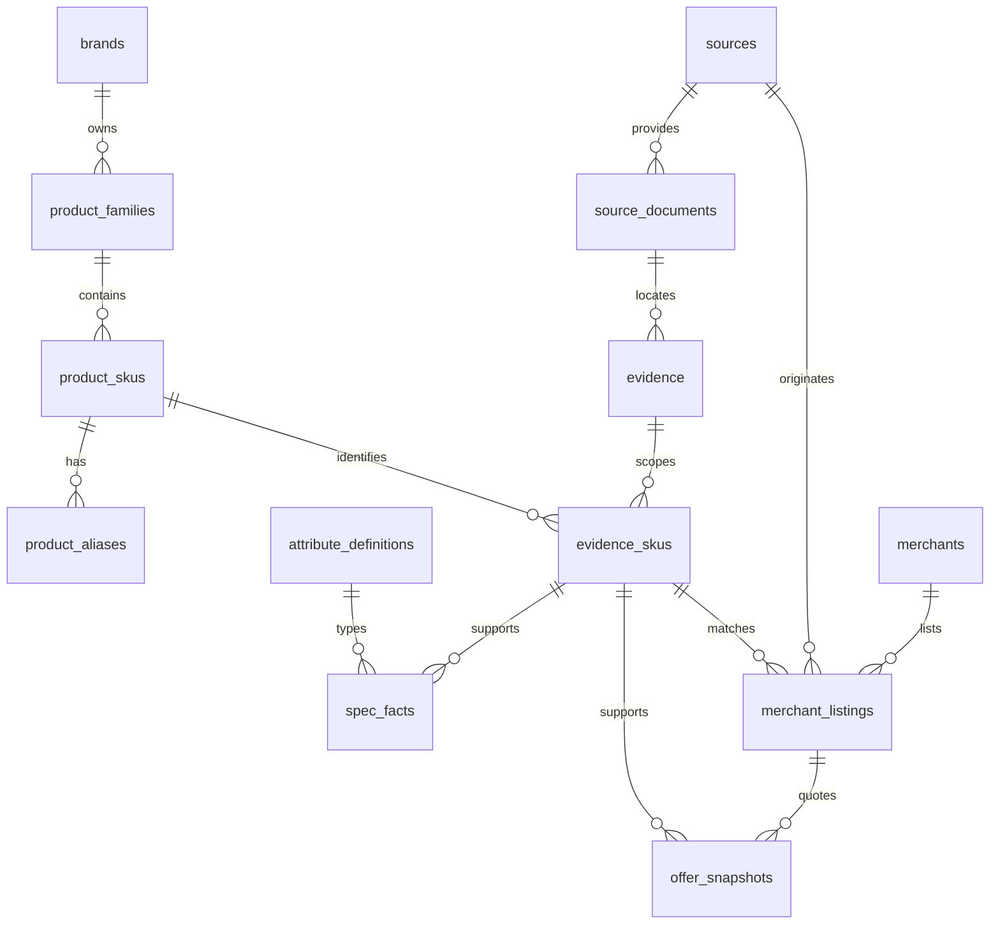

# 商品与证据模型 · T02

步骤 05 建立 13 张空领域表及记录契约；迁移为 `0003_catalog`，上一个版本为 `0002_sessions`。没有导入、审核操作、发布索引或目录查询接口；现有会话和需求保存继续工作。记录结构可在 OpenAPI 的 `Catalog*` schemas 查看，不代表这些记录已可通过 HTTP 写入。

## 关系图

SKU 的身份依据也指向自身 `evidence_skus`。创建顺序是待确认 SKU → 文档/证据 → 证据范围 → 确认身份；身份外键延迟到事务提交检查，防止循环关联要求先写入无效数据。

## 表与字段

除范围连接表外，所有表有 UUID `id`、唯一 `record_key` 和 `synthetic`。合成记录必须使用 `TEST-*`，非合成记录不得使用此前缀。复合外键包含 `synthetic`，阻止两类记录串联。测试仅写独立 `test_*` 数据库，迁移不插入任何商品。

| 表 | 关键字段和约束 |
|---|---|
| brands | name、normalized_name；规范名 lower(trim(name))，同命名空间唯一 |
| product_families | brand_id、category、name；系列不能用于报价 |
| product_skus | family/brand/category 一致；料号及规范料号、地区、revision、配置指纹、身份状态/证据、商品状态 |
| product_aliases | sku_id、alias、normalized_alias、locale；同 SKU 别名唯一，不同 SKU 可以同名，不能直接据此合并 |
| sources | 类型、域名、访问方式、权限状态/依据/检查时间、允许用途、速率；未知权限默认无允许用途 |
| source_documents | source_id、URL、标题、内容 SHA-256、实际采集/发布时间、parser_version、可选 storage_key |
| evidence | document_id、定位类型/位置、摘录 SHA-256、审核记录 |
| evidence_skus | evidence_id + sku_id 联合主键、synthetic；定义证据实际适用范围 |
| attribute_definitions | category + key 唯一；值类型、规范单位、描述 |
| spec_facts | SKU、属性、证据、类型/单位、四种值列、缺失原因、原始值/单位、条件对象、有效区间、审核记录 |
| merchants | 名称、平台、外部卖家 ID；平台/卖家/命名空间唯一 |
| merchant_listings | 商家、来源、外部商品 ID、URL、匹配状态/精确 SKU/匹配证据 |
| offer_snapshots | listing、SKU、证据、金额/运费/税费、币种/地区、库存/成色/资格、采集/失效时间、审核记录 |

字段的完整类型、长度、枚举见 [生成契约](openapi.json)；关系约束见 [SQLAlchemy 模型](../backend/app/catalog/models.py)。Pydantic 严格拒绝额外字段、金额的浮点/字符串/布尔输入和无时区时间；PG 负责外键、唯一性及行内必要条件。SQL 类型转换与输入校验不完全等价，未来写入口必须先使用记录契约和共享服务，不能直接执行任意 SQL。

## 身份与证据

已确认身份的唯一键为品牌、规范料号、地区、revision 状态/值、配置指纹、synthetic。使用 PostgreSQL `NULLS NOT DISTINCT` 的部分唯一索引，仅对 verified 生效，防止空 revision 绕过重复检测。料号未知或 revision 未确认只能 pending；笔记本 verified 还需配置指纹。不同地区和配置保留独立 SKU，别名不能证明身份。

配置指纹目前是输入 SHA-256 字段，未实现配置规范化/指纹生成器；T03 必须明确可复现的规范化输入和算法版本后才导入真实配置。结构上的 verified 只表示身份字段与证据范围完整，不证明资料真实或已获展示许可。证据内容与身份的人工核验、授权和发布门禁在 T03 落实。

文档保存 URL、哈希和定位元数据；本轮不抓取 URL、不存原文、不执行外部文档指令。URL 不允许凭据或 fragment，storage_key 限制相对路径且拒绝 `..`。摘要需要未来导入时由实际内容计算，本轮测试中的摘要均为 synthetic 测试值。

事实通过复合外键同时匹配 SKU 类别、属性类型/规范单位和证据 SKU 范围。已知事实仅可填一个相应类型的值，且保留 raw_value；未知事实所有值为空并提供缺失原因。十进制采用精确字符串输入和 NUMERIC(28,8)，超精度输入在契约层拒绝。条件保留 JSON 对象，本轮不据此执行性能或兼容判断。

同一属性允许多条有证据的冲突声明共存，尚无“最后一条即正确”的查询策略。审核 pending 不带审核者/时间；approved/rejected 必须同时记录两者。审核状态不是发布状态，也没有赋予记录任何公开索引资格。

## 报价与未知值

报价必须挂在 matched listing，SKU 必须与 listing 和证据范围一致，地区必须与 SKU 一致。金额、运费和税费为非负 BIGINT 整数分；缺价为 null 并附原因，未知运费/税费为 null。含税价格不允许再添加正税额。会员/优惠券/捆绑报价必须记录资格说明，不能默认为无条件价格。

UTC 带时区时间，expires_at 必须晚于 observed_at。T05 才实现最长 24 小时等来源时效策略、Provider、当前报价选择和总价函数；仅有有效区间字段不代表报价可用。币种/地区字段当前校验大写代码格式，不进行汇率转换或完整 ISO 注册表验证。

本轮没有写入 API，也未安装阻止所有 SQL UPDATE 的不可变触发器。后续导入与报价服务必须追加事实/快照、保留历史，发布时生成版本；数据库拥有者仍可修改行，不能将本模型宣称为完整审计系统。

## 迁移与验证

`uv run --frozen alembic upgrade head` 建立空表，重复升级无副作用。迁移保存冻结元数据，不导入随应用变化的模型；以后结构变更必须增加迁移。ready 要求 `0003_catalog`，旧库返回未就绪，平台依旧 `not_initialized`、recommendation_available=false。

测试在独立 PG 库先升至 I02，保存需求，再验证升级/重复升级/降级/重建后需求仍在，以及全链关联、重复身份、地区/配置区分、错证据、类型/单位、空值、费用、时间、合成隔离等反例。降级会删除这 13 张领域表，只用于可丢弃测试库；有真实数据后必须先备份并另行审批破坏性回退。

验收见 [T02 清单](research/T02-acceptance.md)，实测记录见 [PROGRESS](PROGRESS.md)。D01 使用许可、D02 精确身份材料、D03 真实报价仍未解除。下一步 T03 做人工导入、预览、审核与事务发布，须等待用户确认。
