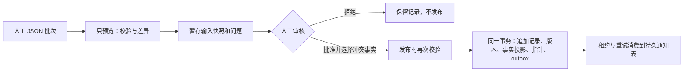

# 人工导入、审核与版本发布 · T03

本轮提供管理员 API 和 CLI，共用 `app/ingestion/service.py`。管理员网页工作台在 T15；现阶段可以通过 API `/docs` 或 CLI 查看完整规范化记录、行错误、差异与审核结果。T04 的公开目录尚未开放，首页仍是数据准备中。



## 管理员身份

`ADMIN_AUTH_CONFIG` 为空或格式无效时，所有 `/api/v1/admin/*` 返回 503 ADMIN_DISABLED；普通会话 cookie 不具备管理员权限。管理员使用独立 Bearer token，原始 token 至少 32 字符，应使用密码学随机值并放入受保护的环境或密码管理器。

配置结构为 `{"operator_id":"指定的操作员代号","token_sha256":"原始token的SHA-256十六进制摘要"}`。只保存 token 摘要，服务端恒定时间比较。审核者从配置推导，上传的 reviewer/reviewed_at/approved 状态不能自行生效；当前是单管理员配置，尚无多人账号管理或双人审批。

CLI 从环境变量 `ADMIN_TOKEN` 读取原始 token，不接受命令行 token 参数，不输出 token。不要把 token 写进文件示例、Git、URL 或浏览器 localStorage。开发预览仍保持管理认证未配置；测试使用独立 TEST 管理员。

HTTP 写入必须 JSON，最多 1 MiB、每批最多 500 行、配置集合最多 100 项，合法管理员每分钟最多 30 次写操作；不同进程共用 PG 限额。浏览器 Origin 必须匹配明确允许的来源；CLI 没有 Origin 时通过独立 Bearer 认证。没有依赖就绪不能操作，错误不输出 SQL 或凭据。Next 不代理管理路由；直接使用后端 `/docs` 或 CLI。

## manual-v1 输入

批次顶层字段：

| 字段 | 语义 |
|---|---|
| format_version | 固定 manual-v1 |
| source_id | 本批文档和 listing 的来源 UUID；来源必须在本批或当前版本中 |
| external_batch_id | 来源内唯一批号；同批号同内容返回同任务，改内容必须使用新批号 |
| synthetic | 测试为 true，记录均须 TEST-*；仅 APP_ENV=test 且 test_* 库接受 |
| rows | `{kind, data}` 记录列表；kind 为 T02 的 13 张表名，data 使用 Catalog* 字段 |
| configurations | 笔记本 SKU UUID → cpu/gpu/memory/storage/display 五个精确配置字符串 |

字段定义在 [OpenAPI](openapi.json) 的 ImportInput/Catalog*。UUID 由采集方稳定保存；不能每次重试重新生成身份。连接表 evidence_skus 用 evidence_id + sku_id，不使用 record_key。金额严格整数分，十进制事实用字符串；时间带时区。

品牌规范名、别名规范名、料号规范值由服务重算；已知 revision 去首尾空格并转小写。笔记本配置指纹为 UTF-8 紧凑、按键排序的 JSON `{"algorithm":"configuration-v1","components":{...}}` 的 SHA-256，五个字符串仅去首尾空格，保持大小写和型号细节；算法不是自动实体识别，配置仍须人工核对身份依据。

事实保留原值与单位。cm→mm、m→mm、kg→g 使用 Decimal 精确核对上传的标准值；不匹配拒绝，其他跨单位转换拒绝。MHz→MT/s、GB→GiB、功率口径不能猜测换算。一个属性在同 SKU/同条件出现多个事实时不会覆盖，审核必须在每组明确选择一个 fact_id，其他声明仍保留历史。

文档/摘录哈希由资料持有者基于实际内容计算，记录实际采集时间和定位；服务不会访问任意 URL 或验证网络正文。本轮 raw_snapshot 是提交的人工结构化 JSON 元数据，不是下载的原文。storage_key 非空会阻止发布，外部原文存储/保留策略尚未实现；导入文件不能包含 token、个人信息或未经许可的原文。

## 预览与审核门禁

preview 返回 content_hash、base_version、逐行 add/unchanged/invalid、字段错误、规范化记录和冲突组。数据库约束在可回滚的保存点内验证，结束后恢复延迟外键状态；预览不留下目录、任务、版本或 outbox 数据。HTTP 仍会记录管理员写限额。

暂存只写 ingestion_jobs 的输入 JSON 快照、内容哈希、预览和 validated 检查点；错误行可以留下 invalid 任务供检查，不能批准。审核批准前必须满足：

- 所有记录和引用有效，引用都在本批或当前版本中，不偷偷引入数据库里其它未发布记录。
- 来源明确 allowed/restricted，并具有 internal_review 和 public_display 用途、许可依据和检查时间。管理员须实际核对依据；文本写着 allowed 不能替代真实授权。
- SKU verified，listing matched，事实/身份/报价有对应 SKU 的证据。批准批次时新证据、事实和报价记录服务端审核者及时间。
- 未解决冲突、客户端伪造审核、未来采集时间、当前数据库与冻结版本不一致均不发布。
- 过期报价、缺失事实/费用作为警告保留；发布不代表报价当前可用、规格完整或可推荐。T04/T05 查询必须继续检查有效区间、费用和用途。

批准或拒绝都要求人工说明。审核请求绑定 content_hash + base_version；若其它批次先发布，旧批次必须新建批号重新预览审核，不能沿用旧决定。发布再次检查，approved 才可执行；重复同一发布返回原版本，不重复创建事件。

## CLI 操作

先按 development.md 配置环境并升级数据库，在 backend 工作目录执行。以下 FILE/JOB/HASH/VERSION 是实际文件/任务输出的占位符，不可原样执行。

```text
uv run --frozen python -m tools.import_catalog preview --file FILE --source SOURCE_UUID
uv run --frozen python -m tools.import_catalog stage --file FILE --dry-run
uv run --frozen python -m tools.import_catalog stage --file FILE
uv run --frozen python -m tools.import_catalog resume --job JOB
uv run --frozen python -m tools.import_catalog review --job JOB --file REVIEW_JSON
uv run --frozen python -m tools.import_catalog publish --job JOB --file PUBLISH_JSON
uv run --frozen python -m tools.import_catalog dispatch
```

REVIEW_JSON：`{"content_hash":"HASH","base_version":null,"decision":"approve","note":"实际核对说明","selected_fact_ids":[]}`。首版 base_version 为 null，以后填写预览中的版本 UUID；拒绝使用 decision=reject。PUBLISH_JSON 只包含相同的 content_hash/base_version。GET/resume 返回持久化检查点，可在客户端中断后继续，若响应丢失也可安全重试 stage/publish。

--since 仅为将来增量适配器保留，manual-v1 明确拒绝；本轮是有界整批导入，没有后台爬取或大文件分块续传。

合成示例可通过 `uv run --frozen python -m tools.synthetic_import` 输出。它固定 TEST 标识、虚构许可、测试金额及历史时间，**不能改 synthetic=false 冒充真实商品**。完整命令行自动验收在 tests/test_ingestion.py 的 test_cli_full_flow_in_isolated_database，自动创建/销毁隔离 test_* 库，不写开发预览库。

## 事务、版本和通知

0004_imports 新增 6 张表：ingestion_jobs、dataset_versions、dataset_pointers、canonical_specs、publication_outbox、dataset_notifications。数据版本保存完整冻结记录；canonical_specs 保存人工选定事实的类型化值，带版本/条件和精确事实外键，后续目录查询须按版本读取并核对事实有效期。

发布在命名空间的 PG 事务锁下串行化：重验 → 追加新记录（已有记录仅能完全相同）→ 冻结版本 → 事实投影 → 当前指针 → outbox → 任务完成。中途异常全部回滚。未提供修改/删除历史的写接口；更正事实或报价使用新 ID，事实冲突由审核选择。商品身份/来源元数据修订、撤回/许可撤销工作流尚未开放，不可宣称具备完整生产数据治理；正式公开目录前须处理相应运营要求。

outbox 消费使用 SKIP LOCKED、30 秒租约、失败退避（上限 300 秒）和 version_id 唯一通知记录。进程崩溃后过期租约可重领，消费端须容忍至少一次投递。当前落地的是持久通知 inbox，没有外部缓存或知识索引，不把 delivered 宣称为 RAG 重建成功。没有自动后台调度；手动 dispatch 可重试，生产调度留待部署阶段。

没有执行下游目录查询/推荐时，平台仍返回 not_initialized、data_version=null；这表示用户可用能力尚未开放。T04 将接入当前真实版本。合成版本独立指针，禁止成为真实版本父节点或投影。

## 验收与限制

参见 [本轮验收](research/T03-acceptance.md)、[演示流程结果](reviews/T03-demo.md)、[进度](PROGRESS.md)。真实 PG 验证了成功链、坏批、重复导入/发布、并发旧版本、选择冲突、故障回滚、历史保留、异常价格提示、未发布引用隔离、通知重试和管理鉴权。

本轮没有获得新的来源授权或真实人工报价。**功能验证与真实样本验收分开：D01—D03 继续阻塞真实发布验收。** 获得允许使用的实际资料后，仍需按此流程核对哈希、身份、字段和许可，再进行真实批次审核。
